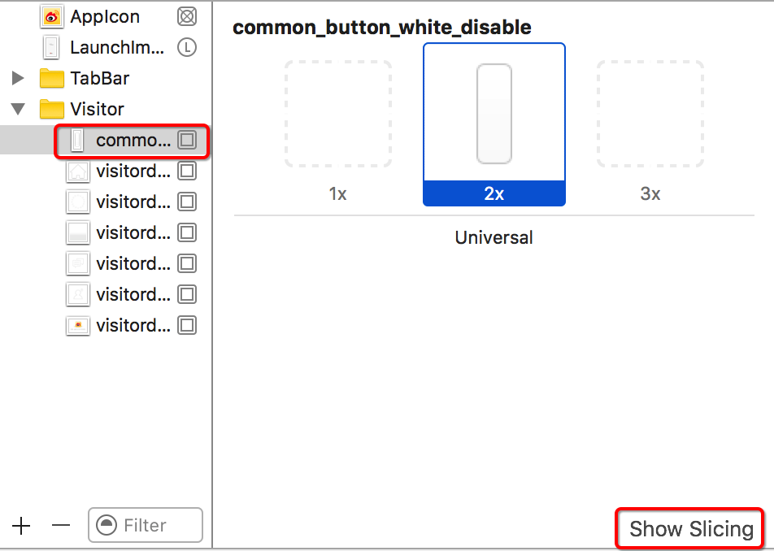
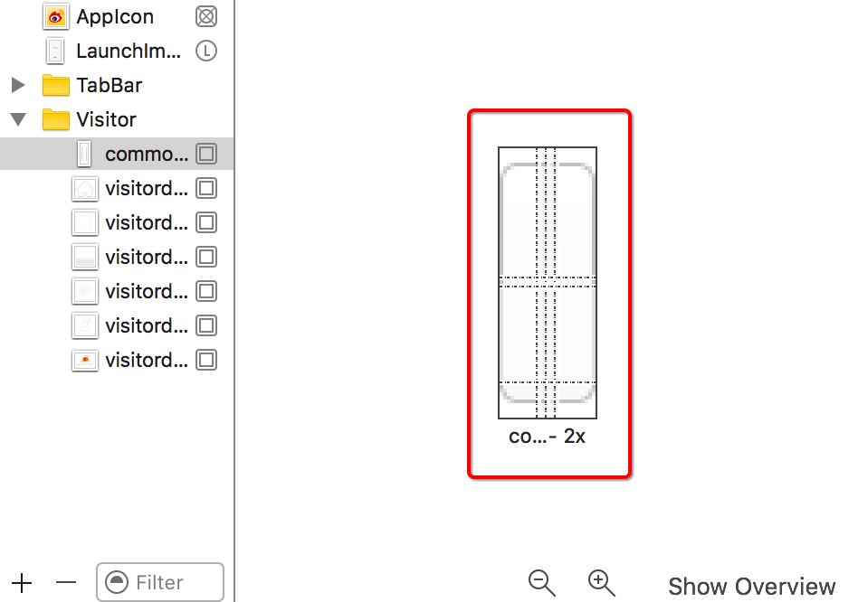

# 自定义View
`注意:`在swift中，如果自定义view，swift强制开发者实现initWithCoder方法，否则会报错。
如果自定义view是代码创建的，但却用xib/SB的方式加载，那么会出现"致命错误"FatalError
所以,

> 错误：The dependency `SnapKit` is not used in any concrete target.因为没有指定target，指定target后，代表所下载的依赖库只在工程中指定的target中生效

```objc
target 'Weibo' do
  pod 'SnapKit', '~> 0.20.0'
end
```
iOS中icon默认是平铺的，若想拉伸图片，可以通过Assets.xcassets->Show Slicing进行拉伸图片。如下图：

**选中拉伸的图片：**


**指定拉伸位置：**


